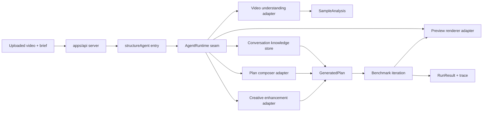
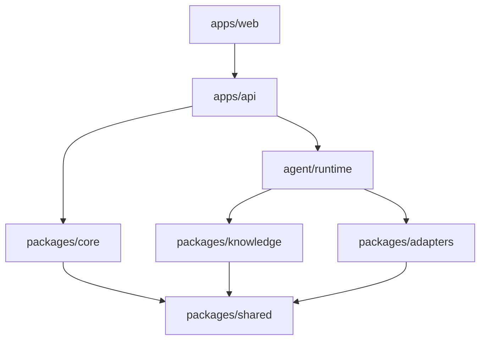

# Architecture

## Direction

The system is a short-video structure-transfer agent. It should transfer reusable creative structure from an uploaded sample video into a new brief, without copying source visuals, original subtitles, brands, people, voices, or copy.

The architecture is organized around three rules:

- `packages/core` owns deterministic domain logic and has no dependency on app-level stores, model adapters, or process environment.
- `apps/api/src/agent/runtime.ts` is the composition seam for concrete adapters: video understanding, plan composition, creative enhancement, preview rendering, and conversation-level knowledge.
- `apps/api/src/structureAgent.ts` is only the orchestration entry point. It creates context, drives the tool-calling loop, falls back when needed, and delegates implementation details to agent modules.

## Flow

## Modules

- `packages/shared`: shared domain contracts such as `SourceInput`, `SampleAnalysis`, `KnowledgeEntry`, `GeneratedPlan`, `TimelineItem`, `BenchmarkScore`, and `CandidateIteration`.
- `packages/core`: deterministic structure extraction helpers, segmenting, slot matching, composition scoring, benchmark scoring, and mock pipeline support. It receives `KnowledgeEntry` explicitly and does not import `@byteproject/knowledge`.
- `packages/knowledge`: seed and conversation-level structure knowledge store.
- `packages/adapters`: concrete integrations for FFmpeg, model calls, model plan composition, creative enhancement, and Remotion preview rendering.
- `apps/api/src/agent/runtime.ts`: the single app-level seam that binds concrete adapters and stores into an `AgentRuntime`.
- `apps/api/src/agent/sampleAnalysis.ts`: converts video understanding results into `SampleAnalysis` and records derived knowledge through the runtime.
- `apps/api/src/agent/planning.ts`: converts model plan output into internal `GeneratedPlan` and applies model enhancement patches.
- `apps/api/src/agent/benchmarkIteration.ts`: scores candidates, applies benchmark-driven revisions, and re-renders candidates.
- `apps/api/src/agent/tools.ts`: declares the tool-calling surface and wires each tool to runtime-backed modules.
- `apps/api/src/agent/fallbackPipeline.ts`: deterministic workflow used when tool-calling cannot complete.
- `apps/api/src/agent/result.ts`: response assembly and trace observation summarization.
- `apps/api/src/structureAgent.ts`: orchestration entry point only.
- `apps/web/src/apiClient.ts`: browser-side API adapter for demo loading, upload, generation, and result export.
- `apps/web/src/workbenchController.ts`: the web workbench state seam. It owns demo loading, URL-backed result tabs, upload lifecycle, generation turns, revision submits, and history mutation.
- `apps/web/src/workbenchConfig.ts`: pure workbench configuration and form-to-API payload mapping. It is the test surface for start validation, default presets, prompt construction, and selling-point normalization.
- `apps/web/src/historyStore.ts`: local history persistence, result compaction, and history formatting.
- `apps/web/src/components/WorkbenchShell.tsx`: working navigation shell. It should contain only actionable navigation/status controls, not disabled roadmap buttons.
- `apps/web/src/components/HistoryWorkspace.tsx`: history page and history summary presentation.
- `apps/web/src/components/ResultPanels.tsx`: result-tab presentation for structure mapping, gap diagnosis, timeline, packaging, and version panels.
- `apps/web/src/resultPresentationModel.ts`: pure presentation model for agent steps, benchmark summaries, timeline labels, gaps, and public result text.
- `apps/web/src/videoFrames.ts`: browser video-frame sampling for upload previews and lightweight vision evidence.
- `apps/web/src/App.tsx`: feature composition. It should not directly call browser API adapters, history storage, generation endpoints, or own shell navigation implementation.

## Dependency Rules

Rules:

- `packages/core` may depend on `packages/shared` only.
- Concrete model, renderer, and knowledge-store dependencies are app composition concerns and should stay behind `AgentRuntime`.
- Tests that exercise agent orchestration should inject a fake `AgentRuntime` rather than touching real providers.
- API response helpers must sanitize local paths and provider details before returning public data.

## Verification Gates

- `npm run test` must cover core behavior and the API runtime seam.
- `apps/web/src/workbenchConfig.test.ts` must cover prompt/payload construction because that is the interface between UI state and the generation API.
- `npm run typecheck` must pass across all workspaces.
- `rg "@byteproject/knowledge|knowledgeStore|seedKnowledge" packages/core` should return no matches.
- `rg "fetchDemoResult|uploadVideoFile|generateStructureTransfer|downloadResultJson|readHistoryEntries|writeHistoryEntries" apps/web/src/App.tsx` should return no matches.
- `node scripts/verify-ui.mjs` asserts that the visible workbench has no disabled shell buttons, no retired placeholder entries, and no common mojibake tokens in rendered text.
- `rg "modelCreativeAdapter|modelPlanComposerAdapter|modelVideoUnderstandingAdapter|remotionStoryboardAdapter" apps/api/src` should show concrete adapters concentrated in `apps/api/src/agent/runtime.ts` plus type-only references.

## Known Limits

- `apps/web/src/App.tsx` still contains several local presentation panels. The workflow state and shell navigation have moved behind deeper modules; the next extraction should be driven by independent ownership or tests, not file-length aesthetics alone.
