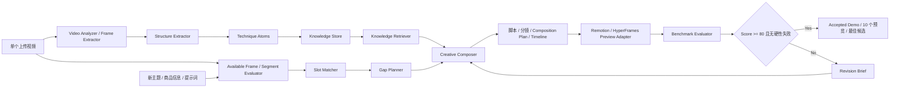

# Architecture

## AI Flow

## Modules

- `packages/shared`: 共享类型，包括 `TechniqueAtom`、`KnowledgeEntry`、`CompositionPlan`、`TimelineItem`。
- `packages/knowledge`: 结构知识库，内置营销类种子原子，并支持沉淀样例拆解结果。
- `packages/core`: P0 深模块，包含单视频结构抽取、关键帧/片段候选、槽位匹配、缺口补全、结果生成、Benchmark Evaluator 和 Iteration Orchestrator。
- `packages/adapters`: 外部工具协议，封装 FFmpeg、Remotion preview、后续 ASR/LLM/AIGC。
- `apps/api`: 上传、分析、生成、导出接口。
- `apps/web`: 可视化工作台。

## Tool Protocol

每个工具 Adapter 需要声明：

- `name`
- `inputSchema`
- `outputSchema`
- `requiredEnv`
- `filePermissions`
- `timeoutMs`
- `fallback`

当前工具：

- FFmpeg Video Analyzer: 读取元数据，失败时降级为 mock metadata。
- Remotion Storyboard Renderer: 当前生成 10 个本地风格赛道的低保真 HTML/Remotion 预览，后续替换为 Remotion MP4。
- Model Adapter: 通过 Ark/Doubao-compatible 接口分析 4-16 张中等抽帧、增强脚本和生成 Remotion/HyperFrames 渲染提示；默认规则链路可运行。
- Benchmark Evaluator: 对生成候选执行 100 分制评分，输出 `BenchmarkScore`、硬性失败、扣分证据、top fixes 和可回传模型的 `revisionBrief`。
- Iteration Orchestrator: 低于 60 分或触发硬性失败时自动重生成，60-79 分可继续优化，80 分以上且无硬性失败才 accepted；默认最多迭代 3 轮并保留最高分候选。
- Knowledge Adapter: 本地知识库读写和检索。

## Safety Boundaries

- 上传视频只用于结构分析、关键帧候选和经验沉淀。
- 禁止复用样例画面、音频、人物、品牌、原字幕、原文案。
- 生成结果只能复用结构描述、原子技巧和包装方法。
- Benchmark 不能把 mock/规则 fallback 包装成真实视频理解；缺少真实视觉 slots 时必须触发分数上限或显式降级说明。
- 用户上传视频只在 `UPLOAD_DIR`、`OUTPUT_DIR`、`TMP_DIR` 内处理。
- 密钥只从环境变量读取，不进入仓库。
- 默认不记录模型 prompt/response。
- 导出结果区分原始素材、衍生素材和补全素材。

## Current P0 Limitations

- 当前视频分析和 ASR 默认走 mock/规则链路。
- 当前成片 demo 是 HTML 低保真预览，还不是 MP4。
- 未接入真实 Doubao/OpenAI-compatible model adapter。
- Benchmark 当前规划为规则 + 可选模型评测；真实实现仍需接入渲染截图、预览可播放检测和低分重生成链路。
- 未实现真实封面图、背景图、配音或视频生成。
