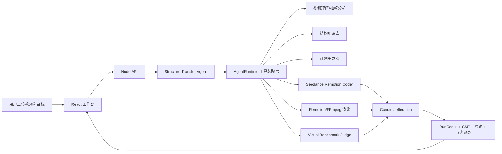

# 爆款结构迁移引擎评审交付文档

## 1. 提交与权限说明

本文件是评审提交用的单一汇总文档，已把项目说明、代码运行说明、演示视频、产出视频、AI 架构、工具协议和安全边界集中到一处。

提交前请在评审平台或共享文档平台完成以下权限设置：

1. 文档链接权限设置为“知道链接的人可查看”。
2. 仓库或代码压缩包权限设置为评委可访问。
3. `docs/delivery-assets/` 下的视频资产需要与本文档一起提交，或上传到同一共享目录并保持链接可访问。
4. 不要提交 `.env`、真实 API Key、用户原始上传素材和 `data/uploads` 临时目录。

## 2. 交付物清单

| 类型 | 位置 | 说明 |
| --- | --- | --- |
| 项目说明文档 | `docs/DELIVERY_DOCUMENT.md` | 本文档，评委阅读入口 |
| 代码 | 仓库根目录 | Monorepo，包含 Web、API、core、knowledge、adapters、shared |
| 运行说明 | 本文档第 5 节 | 包含依赖安装、环境变量、启动、验证 |
| 演示视频 | `docs/delivery-assets/demo-walkthrough.mp4` | 由 UI 验证截图合成的短 walkthrough，展示上传、生成、结果和历史证据页 |
| 产出视频 | `docs/delivery-assets/output-video.mp4` | 最新一次结构迁移生成的候选 MP4 |
| UI 验证截图 | `data/tmp/ui-verification.png`、`data/tmp/ui-history.png` | 本地验证产物，默认不提交到仓库 |
| 生成证据 | `apps/api/data/outputs/candidates/<candidate-id>/` | 每轮候选的 `Composition.tsx`、`remotion.dsl.json`、`score.json`，默认不提交到仓库 |

## 3. 项目说明

项目名称：爆款结构迁移引擎。

项目目标：用户上传一个参考短视频，并输入希望迁移到的新商品或新场景。系统不复制原视频内容，而是提取可迁移的创作结构，例如开头 hook、节奏、镜头槽位、字幕包装、转场方式和 CTA 策略，再生成新的短视频结构方案、Remotion 候选视频和可解释评分结果。

核心能力：

1. 读取上传视频的元数据、抽帧信息和可见结构线索。
2. 将样例视频拆成 `hook`、`body`、`proof`、`offer`、`cta` 等结构槽位。
3. 结合用户目标、商品信息、卖点和目标时长生成新的 `CompositionPlan`。
4. 通过 Seedance Remotion Coder 子智能体生成每轮 Remotion DSL 和代码候选。
5. 渲染候选 MP4，并通过 Visual Benchmark Judge 抽帧评估。
6. 将评分原因反馈给下一轮候选，直到达到 benchmark 或触发停止条件。
7. 在前端展示每轮候选视频、评分原因、工具调用日志和历史记录。

当前状态说明：

- 当 `ARK_API_KEY`、`ARK_ENDPOINT_ID` 或 `SEEDANCE_REMOTION_MODEL`、`VISUAL_JUDGE_MODEL` 配置齐全时，系统会走真实 Ark/Seedance 兼容模型调用。
- 当模型未配置或 `LLM_PROVIDER=mock` 时，系统会进入 mock/fallback 模式。此时候选仍会生成并渲染，但评分会被明确标记为 mock 锁分，最高不能作为正式 benchmark 通过结果。
- 前端历史页会展示“mock 锁分”状态，避免把 mock 评分伪装成真实评审。

## 4. 整体 AI 架构

整体架构采用“前端工作台 + API 智能体编排 + 工具协议适配器 + 可验证产物”的分层方式。



主要模块：

| 模块 | 职责 |
| --- | --- |
| `apps/web` | React 工作台，负责上传、生成、结果展示、历史记录和工具调用 UI |
| `apps/api` | Express API，负责上传、SSE 流、智能体编排和静态输出服务 |
| `packages/shared` | 共享领域类型，例如 `RunResult`、`CandidateIteration`、`BenchmarkScore` |
| `packages/core` | 纯领域逻辑，例如结构抽取、槽位匹配、计划生成和规则评分 |
| `packages/knowledge` | 结构知识库和营销类种子原子 |
| `packages/adapters` | FFmpeg、Remotion、Ark/Seedance、Visual Judge 等工具适配器 |

关键链路：

1. Web 端通过 `/api/upload/:role` 上传视频，并在浏览器侧抽取轻量预览帧。
2. API 端创建 `AgentContext`，进入 `runStructureTransferAgent`。
3. 智能体先尝试 tool-calling 路线；不可用时进入 fallback pipeline。
4. `benchmarkIteration` 负责 Seedance 代码生成、Remotion 渲染、抽帧评审和迭代停止。
5. `/api/generate/stream` 通过 SSE 向前端推送 `tool_use_start`、`tool_use_end`、`run_result` 等事件。
6. 前端只渲染真实工具事件，不再写死假的“我在处理 xxx”卡片。

## 5. 代码运行说明

### 5.1 环境要求

- Node.js 20 或以上
- npm
- Windows、macOS 或 Linux
- 可选：真实 Ark/Seedance 兼容模型凭据

### 5.2 安装依赖

```bash
npm install
```

### 5.3 配置环境变量

复制示例配置：

```bash
cp env.example .env
```

Windows PowerShell 可使用：

```powershell
Copy-Item env.example .env
```

本地无模型凭据时，可在 `.env` 中使用 mock/fallback 模式：

```env
LLM_PROVIDER=mock
ENABLE_MOCK_GENERATION=true
```

真实模型模式需要配置：

```env
LLM_PROVIDER=ark
ARK_BASE_URL=https://ark.cn-beijing.volces.com/api/v3
ARK_API_KEY=<your-api-key>
ARK_ENDPOINT_ID=<your-endpoint-id>
ARK_MODEL=Doubao-Seed-2.0-lite
SEEDANCE_REMOTION_MODEL=<optional-seedance-model>
VISUAL_JUDGE_MODEL=<optional-visual-judge-model>
```

注意：`.env` 已被 `.gitignore` 忽略，不能提交真实密钥。

### 5.4 启动项目

```bash
npm run dev
```

启动后访问：

- Web：http://localhost:5173
- API health：http://localhost:8787/api/health

### 5.5 验证项目

```bash
npm run test
npm run typecheck
node scripts/verify-ui.mjs
```

验证脚本会自动打开本地页面、上传测试视频、生成候选结果、检查右侧工具调用、检查历史页迭代产物，并生成 UI 截图到 `data/tmp/`。

最近一次验证结果摘要：

- 单元和架构测试：13 passed
- 类型检查：通过
- UI 验证：通过
- 历史页迭代产物：2 个候选输出
- 历史页 mock 锁分状态：已展示

## 6. 操作流程

1. 打开 Web 工作台：http://localhost:5173
2. 上传参考视频。
3. 输入迁移目标，例如“把这个横屏科技展示视频迁移成新品发布短视频方案，强调空间感和产品亮相”。
4. 可选填写商品名、目标人群、卖点、时长、画幅。
5. 点击“发送给主智能体”。
6. 在右侧查看当前工具调用卡片，展开可查看本轮工具调用历史。
7. 在“成片”页查看每轮候选视频。
8. 在“评分”页查看 benchmark 维度、扣分原因和下一轮修改方向。
9. 在“历史记录”页展开历史卡，查看每轮产物、视频入口、code hash、judge 类型和评分原因。
10. 如需继续优化，在右侧自然语言输入框提出修改，例如“开头更抓人”“卖点提前”“减少字幕”。

## 7. 工具协议

项目统一采用 `ToolProtocol<I, O>` 作为工具适配器协议：

```ts
type ToolProtocol<I, O> = {
  name: string;
  inputSchema: string;
  outputSchema: string;
  requiredEnv: string[];
  filePermissions: string[];
  timeoutMs: number;
  fallback: string;
  run(input: I): Promise<O>;
};
```

主要工具：

| 工具 | 适配器 | 输入 | 输出 |
| --- | --- | --- | --- |
| 视频元数据分析 | `videoAnalyzerAdapter` | 上传文件路径、角色、文件名 | `VideoMetadata` |
| 多模态视频理解 | `modelVideoUnderstandingAdapter` | 视频元数据、抽帧、用户目标 | 结构摘要、槽位、节奏和视觉笔记 |
| 计划生成 | `modelPlanComposerAdapter` | 用户目标、样例结构、素材段 | `GeneratedPlan` 草案 |
| 创意增强 | `modelCreativeAdapter` | 当前计划和上下文 | 脚本、包装、时间线增强 |
| Seedance Remotion 代码生成 | `seedanceRemotionCoderAdapter` | 当前计划、上一轮反馈、素材段 | Remotion DSL、代码、notes |
| Remotion 渲染 | `remotionStoryboardAdapter` | `GeneratedPlan`、DSL、素材 | MP4 或预览路径 |
| 视觉 benchmark | `visualBenchmarkJudgeAdapter` | 候选视频、抽帧、DSL、代码 | `BenchmarkScore`、frame evidence、下一轮 brief |

前端实时事件协议：

```ts
type AgentToolUseEvent = {
  type: "tool_use_start" | "tool_use_end" | "tool_use_error";
  id: string;
  tool: string;
  at: number;
  title?: string;
  detail?: string;
  meta?: string;
  input?: unknown;
  observation?: unknown;
  ok?: boolean;
};
```

最终结果协议：

- `RunResult.generated`：当前采用的视频方案。
- `RunResult.benchmarkScore`：当前采用方案的总分和维度分。
- `RunResult.iterations`：每轮候选视频、Remotion 证据、评分证据和是否最佳。
- `CandidateRemotionArtifact`：每轮生成的 DSL、代码、输出路径和 code hash。
- `VisualBenchmarkReport`：评审 provider、mock 状态、抽帧证据、原因和下一轮改写 brief。

## 8. 安全边界

内容安全：

1. 只迁移结构，不复制样例视频中的具体人物、品牌、原字幕、声音或原文案。
2. 输出以新 brief 和新素材为中心，样例仅作为结构参考。
3. 如果模型无法真实理解视频，必须标记 mock/fallback，不允许宣称真实视觉评审已完成。

数据安全：

1. `.env`、真实 API Key、endpoint id、Bearer token 不提交。
2. 用户原始上传素材位于 `data/uploads` 或 `apps/api/data/uploads`，默认被 `.gitignore` 忽略。
3. 运行产物位于 `data/outputs` 或 `apps/api/data/outputs`，默认被 `.gitignore` 忽略。
4. API 返回结果会避免暴露本地绝对路径、provider 堆栈和原始密钥。

网络与文件安全：

1. 默认禁用远程 URL 上传：`DISABLE_REMOTE_URL_UPLOAD=true`。
2. 上传文件大小受 `MAX_UPLOAD_MB` 限制。
3. 允许的视频扩展名由 `ALLOWED_VIDEO_EXTENSIONS` 控制。
4. 工具适配器声明 `filePermissions`，写入范围限定在上传、输出或临时目录。

评分安全：

1. mock coder 或 mock judge 会触发 `mock_mode` hard failure。
2. mock 模式候选最高锁定为 59 分，不能正式通过 benchmark。
3. 连续候选如果只改文案、不改 Remotion 结构，会触发 `no_remotion_code_delta` 和 `stagnant_iteration`。
4. Visual Judge 需要基于渲染视频抽帧证据给出原因和下一轮修改方向。

## 9. 评委快速检查点

1. 打开 `docs/DELIVERY_DOCUMENT.md`，确认交付物路径完整。
2. 播放 `docs/delivery-assets/demo-walkthrough.mp4`，快速查看界面流程。
3. 播放 `docs/delivery-assets/output-video.mp4`，查看生成结果视频。
4. 运行 `npm install && npm run dev`，打开 http://localhost:5173。
5. 使用任意短视频上传并生成，观察右侧工具调用是否来自真实 SSE 事件。
6. 打开历史页，展开历史卡，确认能看到每轮候选视频、code hash、judge 类型和评分原因。
7. 无真实模型凭据时，确认页面明确显示 mock 锁分，不会伪装成真实高分结果。
8. 配置真实 Ark/Seedance 凭据后，确认 `seedanceRemotionCoderAdapter` 和 `visualBenchmarkJudgeAdapter` 会走真实 provider。

## 10. 已知限制

1. 本仓库不会提交用户上传原始素材和运行时输出目录，评审提交使用 `docs/delivery-assets/` 中整理后的演示资产。
2. `demo-walkthrough.mp4` 是由自动化 UI 验证截图合成的短演示视频，不是人工实时录屏。
3. 无真实模型凭据时，系统会以 mock/fallback 模式运行，便于评委本地复现，但不会产生正式通过 benchmark 的高分。
4. 若要正式评测模型质量，需要配置真实 `ARK_API_KEY`、`ARK_ENDPOINT_ID` 和对应 Seedance/Visual Judge 模型。
